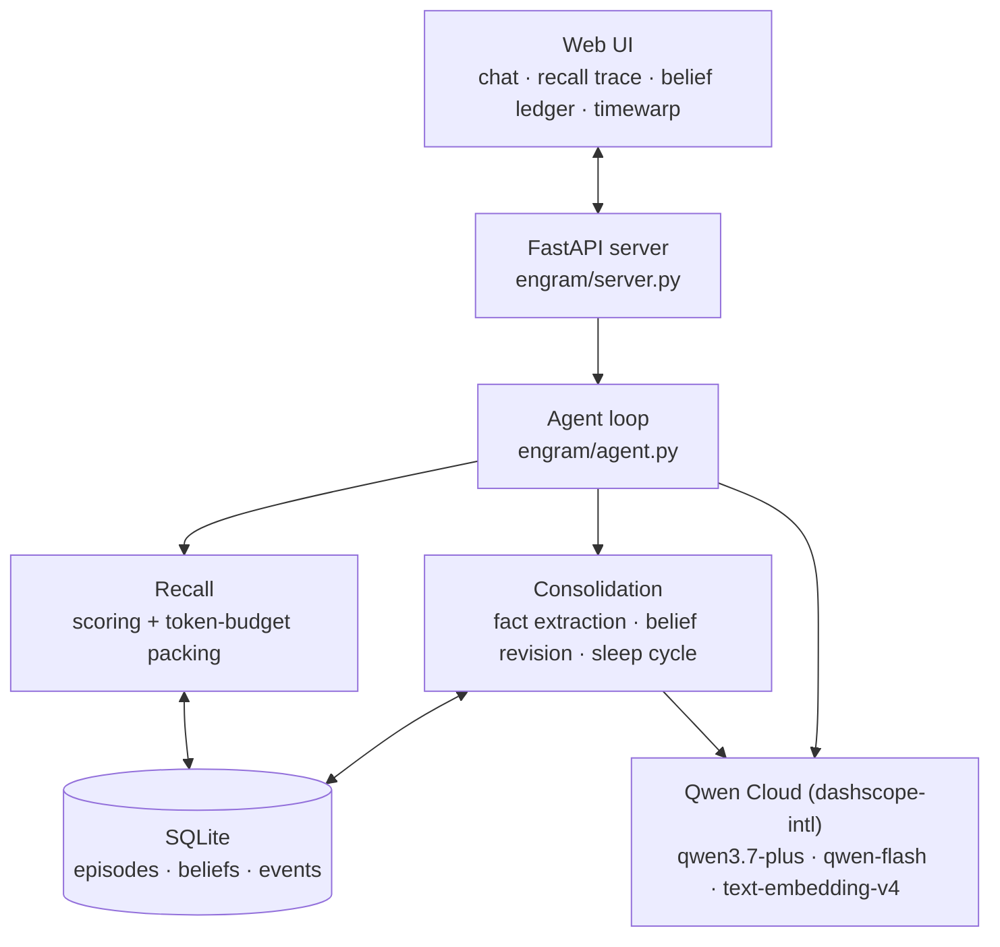

# Engram

A memory engine for AI agents that forgets on purpose.

Built for the Global AI Hackathon Series with Qwen Cloud, **Track 1: MemoryAgent**.

## The problem

The usual way to give an agent "memory" is to embed the chat history into a vector store and search it on every turn. That approach has three problems that get worse the longer the agent runs:

1. It never forgets. A fact from March is retrieved with the same confidence as one from this morning, even after the user said it changed.
2. It grows without limit. More history means more candidates and worse retrieval precision.
3. Top-k retrieval has no notion of a context budget. A few long chunks can eat half the window before the user's question even arrives.

Engram borrows the mechanism human memory uses to solve all three: forgetting.

## How it works

**Memories decay.** Every memory has a stability value S (in hours) and its retention follows the Ebbinghaus curve `R(t) = exp(-t/S)`. When a memory is recalled into context, its stability grows (`S' = 1.6*S + 12h`), the same update spaced-repetition systems use. Memories the agent actually uses become close to permanent. Memories it never touches fade.

**Facts become beliefs, and beliefs get superseded rather than overwritten.** A cheap model pass distils each user message into (subject, predicate, object) facts, for example `(user, is allergic to, shellfish)`. When a new fact collides with a held belief, such as "I moved to Ponta Delgada" against `(user, lives in, Lisbon)`, the model decides whether the new fact replaces the old one, coexists with it, or gets discarded. A replaced belief is not deleted. It keeps its validity interval and a link to its successor, so the agent knows both what is true now and what used to be true. Every belief also keeps a link to the exact message it was learned from.

**Faded memories get consolidated.** A periodic "sleep cycle" finds episodes whose retention has dropped below a threshold, compresses each group into a short summary, and archives the originals. The gist survives at a fraction of the token cost, and total storage levels off instead of growing forever.

**Recall runs under a fixed token budget.** Each candidate memory is scored by semantic similarity, importance, and recency, multiplied by its current retention. The best set is then packed under a hard budget (1,200 tokens by default) using a greedy knapsack on score per token. The memory context stays the same size whether the agent has one day of history or one year.

## Results

The benchmark compares two agents that use the identical Qwen model. The only difference is the memory engine. The scenario runs three sessions separated by simulated weeks, then asks seven questions whose answers depend on earlier sessions. Answering with a superseded fact (the old city, the old project name) counts as wrong. A qwen-flash judge grades the answers.

| | Engram | Stateless baseline |
|---|---|---|
| Cross-session recall | 7/7 (100%) | 0/7 (0%) |
| Avg memory context per question | 318 tokens (budget: 1,200) | n/a |

Reproduce it with `python -m eval.run_eval`. A recorded run is committed at [`eval/sample_results.json`](eval/sample_results.json) and [`eval/sample_eval_output.txt`](eval/sample_eval_output.txt).

## Architecture



The design rationale, scoring formulas, and failure handling are documented in [ARCHITECTURE.md](ARCHITECTURE.md).

## Proof of Alibaba Cloud deployment

Every model call goes through [`engram/qwen_cloud.py`](engram/qwen_cloud.py), which targets the Alibaba Cloud Model Studio (DashScope) international endpoint, `https://dashscope-intl.aliyuncs.com/compatible-mode/v1`. Three models are used: `qwen3.7-plus` for the agent's replies, `qwen-flash` for fact extraction, belief adjudication, consolidation summaries, and benchmark judging, and `text-embedding-v4` for the 512-dimensional memory embeddings.

To run the backend on Alibaba Cloud ECS: provision a small instance (`ecs.e-c1m1.large`, Ubuntu 22.04, ideally in `ap-southeast-1` for low latency to the DashScope endpoint), clone this repo, install the requirements into a venv, put `DASHSCOPE_API_KEY` in `.env`, and run uvicorn under systemd. Memory state lives in a single SQLite file (`data/engram.db`), so it survives restarts; swap `MemoryStore` for ApsaraDB RDS if you need more than one instance.

## Quickstart

```bash
git clone https://github.com/abdelaalimouid/Engram-v1.git && cd Engram-v1
python3 -m venv .venv && .venv/bin/pip install -r requirements.txt

# Qwen Cloud API key (https://home.qwencloud.com/api-keys)
echo 'DASHSCOPE_API_KEY=sk-...' > .env

.venv/bin/uvicorn engram.server:app --host 0.0.0.0 --port 8000
# open http://localhost:8000
```

## Trying it out

1. Tell Engram some things about yourself in session 1: your name, your job, an allergy, a project. The belief ledger on the right fills with extracted facts.
2. Click "+30 days" to advance the simulated clock. The retention bars in the Episodes tab drop, since a month has passed without any of those memories being recalled.
3. Click "sleep cycle". Faded episodes are compressed into a summary and archived.
4. Start a new session and tell it something that contradicts an earlier fact ("I moved to Berlin"). The old belief shows struck through in the ledger, superseded but kept.
5. Ask a question that depends on older sessions. The recall trace shows which memories were retrieved, their scores, and how their stability was reinforced by being recalled.

The simulated clock exists so that decay and consolidation, which normally take weeks, can be observed in minutes. The offset is applied uniformly to every timestamp, so the accelerated behaviour is identical to real elapsed time.

## Benchmark and tests

```bash
.venv/bin/python -m eval.run_eval   # Engram vs stateless baseline (makes API calls)
.venv/bin/python -m pytest tests/   # unit tests for the memory math, no network needed
```

## Repository map

| Path | Contents |
|---|---|
| `engram/qwen_cloud.py` | Alibaba Cloud integration; all Qwen model calls |
| `engram/forgetting.py` | Decay and reinforcement math |
| `engram/store.py` | SQLite store: episodes, bi-temporal beliefs, event log, simulated clock |
| `engram/retrieval.py` | Recall scoring and token-budget packing |
| `engram/consolidation.py` | Fact extraction, belief revision, sleep cycle |
| `engram/agent.py` | Agent loop |
| `engram/server.py` | FastAPI API and static UI hosting |
| `web/` | Browser UI |
| `eval/` | Benchmark against the stateless baseline |
| `tests/` | Unit tests |

## License

[MIT](LICENSE)
