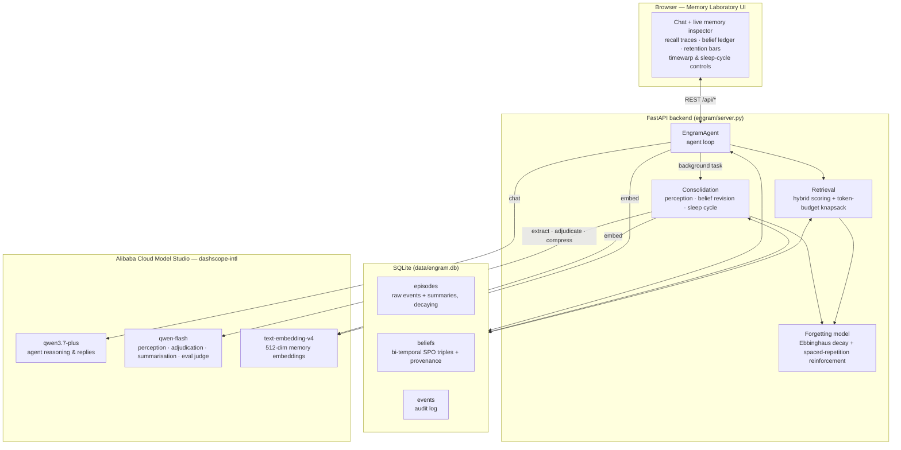

# Engram — a memory that forgets on purpose

**Track 1: MemoryAgent · Global AI Hackathon Series with Qwen Cloud**

Every "memory agent" demo is the same trick: dump chat history into a vector store and RAG over it. That isn't memory — it's a search index that grows forever, retrieves stale facts with the same confidence as fresh ones, and drowns the context window as it scales.

Engram is a cognitive memory engine built on Qwen Cloud that treats **forgetting as a feature**, modeled on how biological memory actually works:

- **Memories decay.** Every memory follows an Ebbinghaus forgetting curve `R(t) = e^(−Δt/S)`. Recall reinforces it (spaced repetition — stability grows multiplicatively); neglect fades it toward consolidation.
- **Beliefs are bi-temporal.** Facts are never deleted, they're *superseded* with validity intervals and provenance. Engram knows the user lived in Lisbon *until* week 3, and lives in Ponta Delgada *now* — and answers accordingly.
- **Sleep cycles consolidate.** A background process compresses faded episodic memories into dense semantic summaries and archives the originals — the gist survives at a fraction of the token cost.
- **Recall is budgeted.** Retrieval scores every belief and episode (similarity × importance × recency, gated by retention), then packs the best set under a hard token budget with a greedy knapsack by score-density. The context window never bloats, no matter how much the agent has lived.

## Results

Benchmarked against a stateless baseline using the *same* Qwen model — the only variable is the memory engine. Three sessions separated by simulated weeks; the quiz requires both cross-session recall and belief revision (outdated answers count as wrong). See [`eval/run_eval.py`](eval/run_eval.py).

| | Engram | Stateless baseline |
|---|---|---|
| Cross-session recall accuracy | **7/7 (100%)** | 0/7 (0%) |
| Avg memory context per question | **318 tokens** (budget 1,200) | — |
| Belief supersessions handled | yes (bi-temporal, e.g. Lisbon → Ponta Delgada) | — |

The quiz includes belief-revision traps — answering with the *old* city or *old* project name counts as wrong. Reproduce with `python -m eval.run_eval`; a committed run is in [`eval/sample_results.json`](eval/sample_results.json) and [`eval/sample_eval_output.txt`](eval/sample_eval_output.txt).

## Architecture



Full design rationale in [ARCHITECTURE.md](ARCHITECTURE.md).

## Proof of Alibaba Cloud deployment

All model calls go through [`engram/qwen_cloud.py`](engram/qwen_cloud.py), which targets the Alibaba Cloud Model Studio (DashScope) international endpoint `https://dashscope-intl.aliyuncs.com/compatible-mode/v1` using `qwen3.7-plus`, `qwen-flash`, and `text-embedding-v4`.

To run the backend on Alibaba Cloud ECS: provision a small instance (e.g. `ecs.e-c1m1.large`, Ubuntu 22.04, ideally in `ap-southeast-1` for lowest latency to the DashScope endpoint), clone this repo, install requirements into a venv, put `DASHSCOPE_API_KEY` in `.env`, and run `uvicorn engram.server:app --host 0.0.0.0 --port 8000` (under systemd for persistence). Memory state lives in `data/engram.db`; attach a cloud disk or swap `MemoryStore` for ApsaraDB RDS for multi-instance deployments.

## Quickstart

```bash
git clone https://github.com/abdelaalimouid/engram.git && cd engram
python3 -m venv .venv && .venv/bin/pip install -r requirements.txt

# Qwen Cloud API key (https://home.qwencloud.com/api-keys)
echo 'DASHSCOPE_API_KEY=sk-...' > .env

.venv/bin/uvicorn engram.server:app --host 0.0.0.0 --port 8000
# open http://localhost:8000
```

### The 3-minute demo

1. **Session 1** — tell Engram about yourself: name, job, an allergy, a project. Watch the *Belief ledger* fill with (subject, predicate, object) triples extracted by qwen-flash.
2. **⏩ +30 days** — advance the simulated clock. Open *Episodes*: retention bars have collapsed; verbatim memories are fading.
3. **☾ sleep cycle** — faded episodes are compressed into one dense summary and archived. Gist retained, tokens released.
4. **New session** — ask "where do I live?" after telling it you moved. The old belief is struck through in the ledger — superseded, not deleted — and the answer uses the new one.
5. Every reply shows its **recall trace**: which memories fired, their strength, and their reinforcement (`stability 48h → 89h`).

### Run the benchmark & tests

```bash
.venv/bin/python -m eval.run_eval   # Engram vs stateless baseline (uses API credits)
.venv/bin/python -m pytest tests/   # offline unit tests for the memory math
```

## Repo map

| Path | What it is |
|---|---|
| `engram/qwen_cloud.py` | **Alibaba Cloud integration** — all Qwen model calls |
| `engram/forgetting.py` | Ebbinghaus decay + spaced-repetition reinforcement math |
| `engram/store.py` | SQLite store: episodes, bi-temporal beliefs, event log, timewarp clock |
| `engram/retrieval.py` | Hybrid scoring + token-budget knapsack packing |
| `engram/consolidation.py` | Perception, belief revision with contradiction adjudication, sleep cycle |
| `engram/agent.py` | The agent loop |
| `engram/server.py` | FastAPI API + static UI hosting |
| `web/` | Memory laboratory UI |
| `eval/` | Benchmark vs stateless baseline |
| `tests/` | Offline unit tests |

## License

[MIT](LICENSE)
